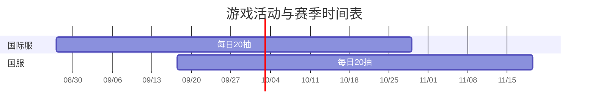

时间表由共享游戏资料生成，时间均为北京时间。推算时间会单独标注。

| 项目 | 服务器 | 开始 | 结束 | 日期依据 |
| --- | --- | --- | --- | --- |
| 每日20抽 | 国际服 | 2026-08-27 02:00 | 2026-10-29 02:00 | 已填写；依据见资料来源 |
| 每日20抽 | 国服 | 2026-09-17 11:00 | 2026-11-19 11:00 | 已填写；依据见资料来源 |

尚未填写日期的类别只提供默认规则，不显示为已确认赛季。
