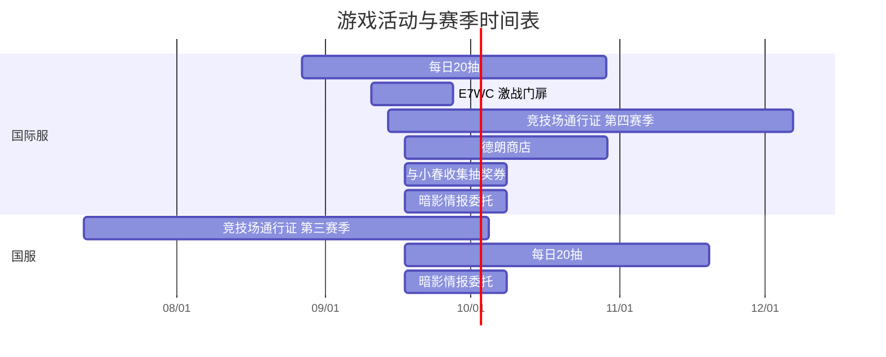

时间表由共享游戏资料生成，时间均为北京时间。国服自动顺延会单独标注；手动推算的依据见共享资料的来源说明。

| 项目 | 服务器 | 开始 | 结束 | 日期依据 |
| --- | --- | --- | --- | --- |
| 竞技场通行证 第三赛季 | 国服 | 2026-07-12 20:00 | 2026-10-04 20:00 | 已填写；依据见资料来源 |
| 竞技场通行证 第四赛季 | 国际服 | 2026-09-13 20:00 | 2026-12-06 20:00 | 已填写；依据见资料来源 |
| 暗影情报委托 | 国际服 | 2026-09-17 11:00 | 2026-10-08 11:00 | 已填写；依据见资料来源 |
| 暗影情报委托 | 国服 | 2026-09-17 11:00 | 2026-10-08 11:00 | 已填写；依据见资料来源 |
| 每日20抽 | 国际服 | 2026-08-27 02:00 | 2026-10-29 02:00 | 已填写；依据见资料来源 |
| 每日20抽 | 国服 | 2026-09-17 11:00 | 2026-11-19 11:00 | 已填写；依据见资料来源 |
| E7WC 激战门扉 | 国际服 | 2026-09-10 11:00 | 2026-09-27 11:00 | 已填写；依据见资料来源 |
| 与小春收集抽奖券 | 国际服 | 2026-09-17 11:00 | 2026-10-08 11:00 | 已填写；依据见资料来源 |
| 德朗商店 | 国际服 | 2026-09-17 11:00 | 2026-10-29 11:00 | 已填写；依据见资料来源 |

尚未填写日期的类别只提供默认规则，不显示为已确认赛季。
